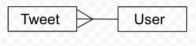
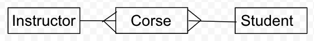

# One to Many Relationships

## Objectives

* Implement one object to many objects relationship
  * `one_to_many`
  * One object `has_many` objects
  * One object `belongs_to` another object
  * `many_to_many`
  * Object one `has_many` objects `through` a `join`
  * Object two `has_many` objects `through` a `join`
  * A `join` belongs to one instance of object one andd one instance of object 2
* Practice passing custom objects as arguments to methods
* Demonstrate single source of truth
* Infer type of method (class or instance) through naming conventions

## Domain Modeling 

* Model: A class whose primary responsibility is to store data
* Domain: The subject matter of the problem
* Domain modeling: Creating models for your domain to represent real or abstract ideas 
* Relationships: How one model or thing is connected to another model or thing
- Examples:
    - A tween belongs to a user
    - A user has many tweets

## Deliverables

* Create a User class. The class should have these methods:
  * `#initialize` which takes a username and have
  * a reader method for the username
  * `#tweets` that returns an array of Tweet instances
  * `#post_tweet` that takse a message, creates a new tweet, and adds it to the user's tweet collection
* Create a Tweet class. The class should have these methods:
  * `Tweet#message` that returns a string
  * `Tweet#user` that returns an instance of the user class
  * `Tweet.all` that returns all the Tweets created.
  * `Tweet#username` that returns the username of the tweet's user

* Part II
  User class
  * `#like_tweet` that accepts as a tweet instance as a parameter
  * `#liked_tweets` that returns a collection of all the tweets this user has liked
Tweet class
  * `#likers` that returns a collection of all the Users who have liked this tweet
